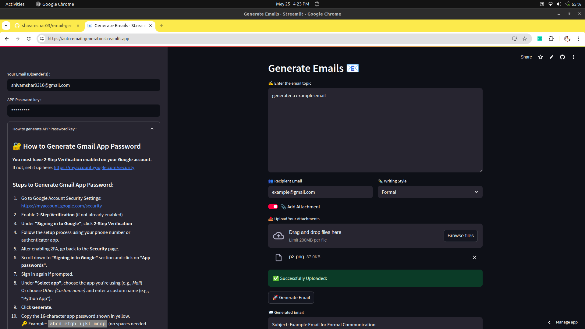

# 📧 AI-Powered Email Generator and Sender

A Streamlit web application that uses Groq's LLaMA 3 LLM to generate professional, styled emails and send them via Gmail using Yagmail.

## 🌐 Live Demo

🚀 Check it out here: [Email Generator](https://auto-email-generator.streamlit.app/)

---

## ✨ Features

- 🤖 Generate emails with LLaMA 3 (via Groq)
- 💬 Choose the tone: formal, casual, friendly, etc.
- 📧 Send emails using your Gmail account
- 📎 Attach files with your message
- 🌐 Simple Streamlit UI for interaction

---

## ✨ Screenshots
> 

---

## 🚀 Getting Started

### 🔧 Prerequisites

- Python 3.9+
- A Gmail account with **App Passwords** enabled
- Groq API Key (via [Groq Developer Platform](https://console.groq.com))

### 📦 Installation

1. Clone the repository:

```bash
git clone https://github.com/your-username/email-llm-sender.git
cd email-llm-sender
```
2. Create Virtual Environment and Install Dependencies:

```bash
python -m venv .venv
source .venv/bin/activate  # On Windows: .venv\Scripts\activate
pip install -r requirements.txt
```
3. To run the Application:

```bash
streamlit run app.py
```


<!-- Screenshot from 2025-05-25 16-23-55.png-->
